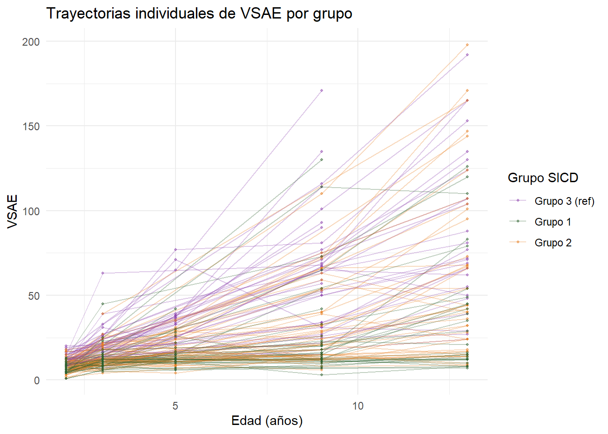
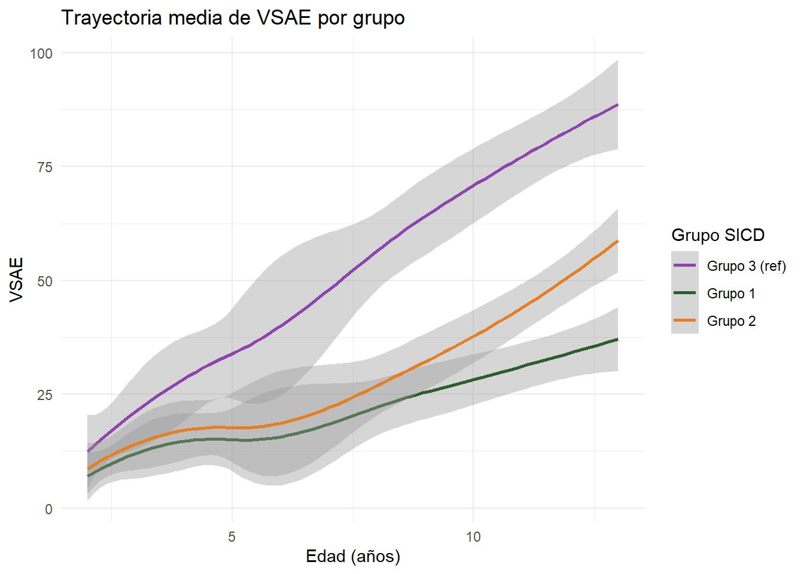
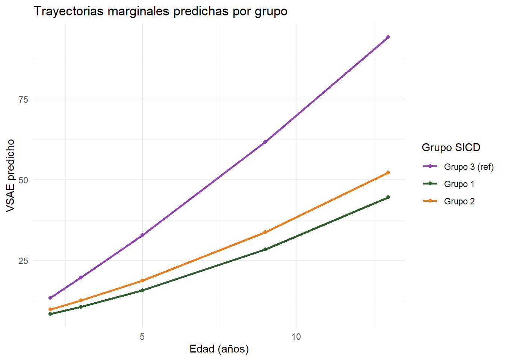
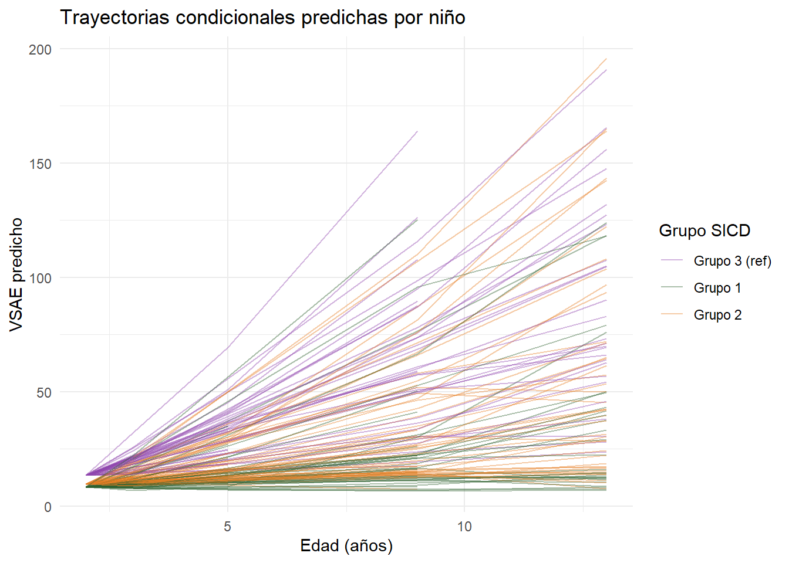
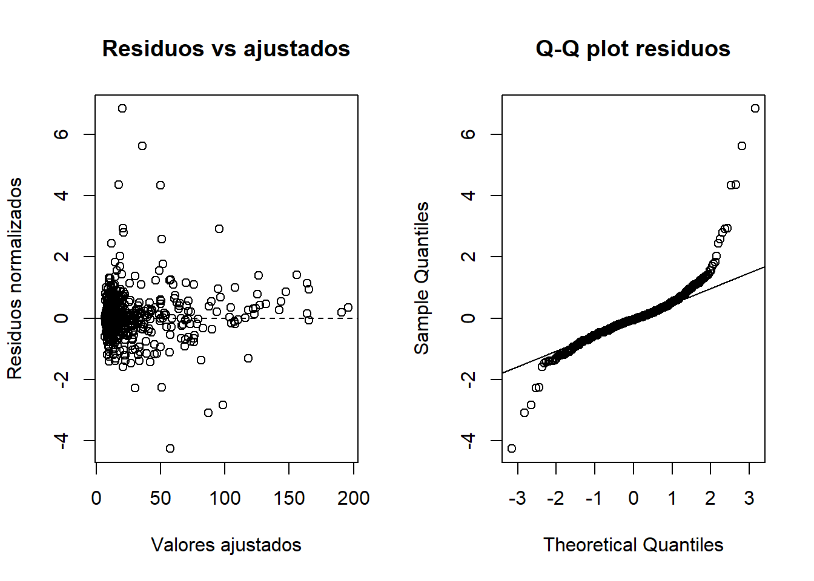
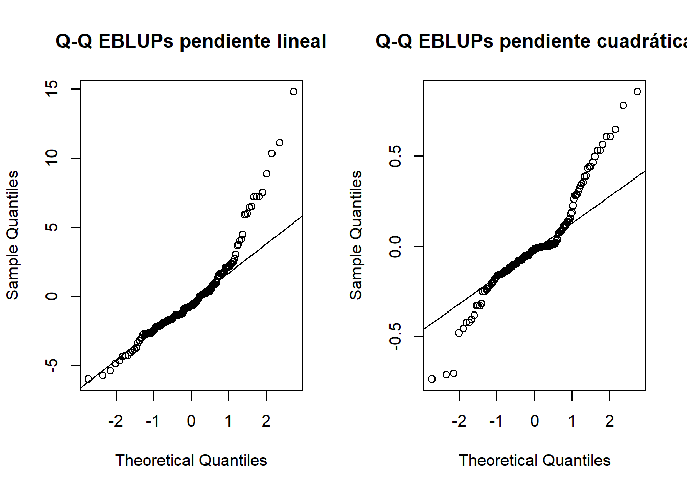

## 1.🧠Problema de investigación

Se estudia el desarrollo de la socialización (`vsae`)
en niños con autismo a lo largo del tiempo. Los niños fueron
medidos a los 2, 3, 5, 9 y 13 años.

> **Pregunta central:** ¿Cómo evoluciona el desarrollo de la socialización con la edad,
y difiere esta trayectoria según el grupo de competencia lingüística
inicial (`sicdegp`)?

## 2.🧠Diseño longitudinal

- Datos **longitudinales** — mismos niños medidos en múltiples
  momentos del tiempo
- Nivel 2: **niño** (`childid`)
- Nivel 1: **medición** en el tiempo (`age`)
- Las mediciones dentro de un mismo niño no son independientes
- Diseño **desbalanceado** — no todos los niños tienen todas
  las mediciones


::: {.cell}

```{.r .cell-code}
nrow(autism_updated)
```

::: {.cell-output .cell-output-stdout}

```
[1] 610
```


:::

```{.r .cell-code}
n_distinct(autism_updated$childid)
```

::: {.cell-output .cell-output-stdout}

```
[1] 158
```


:::

```{.r .cell-code}
autism_updated |>
  count(childid, name = "n_mediciones") |>
  count(n_mediciones, name = "n_ninos")
```

::: {.cell-output .cell-output-stdout}

```
  n_mediciones n_ninos
1            1       2
2            2      14
3            3      29
4            4      72
5            5      41
```


:::

```{.r .cell-code}
table(autism_updated$age, autism_updated$sicdegp2.f)
```

::: {.cell-output .cell-output-stdout}

```
    
      0  1  2
  2  40 50 66
  3  38 47 64
  5  26 29 36
  9  35 36 48
  13 26 28 41
```


:::
:::


## 3.🧠Variables

| Variable | Nivel | Tipo | Rol | Codificación |
|----------|-------|------|-----|--------------|
| `vsae` | 1 | Continua | **Outcome** | Habilidades sociales verbales |
| `age` | 1 | Continua | Tiempo | 2, 3, 5, 9, 13 años |
| `age.2` | 1 | Continua | Tiempo centrado | age − 2 |
| `age.2sq` | 1 | Continua | Curvatura | age.2² |
| `childid` | 2 | Identificador | Sujeto | Niño |
| `sicdegp` | 2 | Categórica | Predictor | Grupo de competencia lingüística inicial |
| `sicdegp2.f` | 2 | Categórica | Predictor recodificado | Grupo 3 = ref (0), Grupo 1 = 1, Grupo 2 = 2 |

> **¿Por qué centrar la edad en 2?** Porque los niños tienen
> 2 años en la primera medición. Así el intercepto representa
> el VSAE esperado **al inicio del seguimiento**, no al año 0.

## 4.🧠Exploración descriptiva


::: {.cell}
::: {.cell-output-display}
{width=672}
:::
:::


::: {.cell}
::: {.cell-output-display}
{width=672}
:::
:::


## 5.🧠Estrategia top-down

```{mermaid}
flowchart TD
    A[Model 6.1\nIntercepto + pendiente lineal\n+ pendiente cuadrática aleatorias] --> B{Problema\nMatriz D mal condicionada}
    B --> C[Model 6.2\nSin intercepto aleatorio]
    C --> D{H6.1\n¿Pendiente cuadrática aleatoria?}
    D -->|Sí p<0.001| E{H6.2\n¿Interacción grupo x edad cuadrática?}
    E -->|No p=0.39| F[Model 6.3\nSin interacción cuadrática]
    F --> G{H6.3\n¿Interacción grupo x edad lineal?}
    G -->|Sí p<0.001| H[Model 6.3 — Modelo Final]
```

## 6.🧠Model 6.1 — Modelo cargado

Este modelo incluye intercepto, pendiente lineal y cuadrática
como efectos aleatorios. West lo ajusta primero pero encuentra
problemas de convergencia — la varianza del intercepto aleatorio
es prácticamente nula.


::: {.cell}

```{.r .cell-code}
model6.1.fit <- lme(
  vsae ~ age.2 + I(age.2^2) + sicdegp2.f +
    age.2:sicdegp2.f + I(age.2^2):sicdegp2.f,
  random = ~ age.2 + I(age.2^2),
  method = "REML",
  data = autism.grouped)
```

::: {.cell-output .cell-output-error}

```
Error in `lme.formula()`:
! nlminb problem, convergence error code = 1
  message = iteration limit reached without convergence (10)
```


:::

```{.r .cell-code}
summary(model6.1.fit)
```

::: {.cell-output .cell-output-error}

```
Error in `h()`:
! error al evaluar el argumento 'object' al seleccionar un método para la función 'summary': objeto 'model6.1.fit' no encontrado
```


:::
:::


> La varianza del intercepto aleatorio es prácticamente cero,
> lo que indica que los niños no difieren significativamente
> en su VSAE inicial a los 2 años — solo en sus trayectorias.

## 7.🧠Model 6.2: Sin intercepto aleatorio

Se elimina el intercepto aleatorio con `-1` en la fórmula
de efectos aleatorios.


::: {.cell}

```{.r .cell-code}
model6.2.fit <- lme(
  vsae ~ age.2 + I(age.2^2) + sicdegp2.f +
    age.2:sicdegp2.f + I(age.2^2):sicdegp2.f,
  random = ~ age.2 + I(age.2^2) - 1,
  method = "REML",
  data = autism.grouped)
summary(model6.2.fit)
```

::: {.cell-output .cell-output-stdout}

```
Linear mixed-effects model fit by REML
  Data: autism.grouped 
       AIC      BIC    logLik
  4641.276 4698.457 -2307.638

Random effects:
 Formula: ~age.2 + I(age.2^2) - 1 | childid
 Structure: General positive-definite, Log-Cholesky parametrization
           StdDev    Corr  
age.2      3.8298024 age.2 
I(age.2^2) 0.3625824 -0.317
Residual   6.2047262       

Fixed effects:  vsae ~ age.2 + I(age.2^2) + sicdegp2.f + age.2:sicdegp2.f + I(age.2^2):sicdegp2.f 
                           Value Std.Error  DF   t-value p-value
(Intercept)            13.769637 0.8093779 446 17.012618  0.0000
age.2                   5.603481 0.7938042 446  7.059021  0.0000
I(age.2^2)              0.203999 0.0816167 446  2.499473  0.0128
sicdegp2.f1            -5.415784 1.0934935 155 -4.952735  0.0000
sicdegp2.f2            -4.037378 1.0293605 155 -3.922220  0.0001
age.2:sicdegp2.f1      -3.296437 1.0915657 446 -3.019916  0.0027
age.2:sicdegp2.f2      -2.746559 1.0270067 446 -2.674334  0.0078
I(age.2^2):sicdegp2.f1 -0.134615 0.1133821 446 -1.187271  0.2358
I(age.2^2):sicdegp2.f2 -0.129699 0.1055228 446 -1.229104  0.2197
 Correlation: 
                       (Intr) age.2  I(g.2^2) scd2.1 scd2.2 a.2:2.1 a.2:2.2
age.2                  -0.418                                              
I(age.2^2)              0.318 -0.586                                       
sicdegp2.f1            -0.740  0.310 -0.235                                
sicdegp2.f2            -0.786  0.329 -0.250    0.582                       
age.2:sicdegp2.f1       0.304 -0.727  0.426   -0.426 -0.239                
age.2:sicdegp2.f2       0.323 -0.773  0.453   -0.239 -0.425  0.562         
I(age.2^2):sicdegp2.f1 -0.229  0.422 -0.720    0.321  0.180 -0.592  -0.326 
I(age.2^2):sicdegp2.f2 -0.246  0.453 -0.773    0.182  0.320 -0.329  -0.590 
                       I(.2^2):2.1
age.2                             
I(age.2^2)                        
sicdegp2.f1                       
sicdegp2.f2                       
age.2:sicdegp2.f1                 
age.2:sicdegp2.f2                 
I(age.2^2):sicdegp2.f1            
I(age.2^2):sicdegp2.f2  0.557     

Standardized Within-Group Residuals:
        Min          Q1         Med          Q3         Max 
-4.22352306 -0.37936451 -0.05010264  0.28909578  6.88643142 

Number of Observations: 610
Number of Groups: 158 
```


:::
:::


## 8.🧠H6.1: ¿Es necesaria la pendiente cuadrática aleatoria?


::: {.cell}

```{.r .cell-code}
model6.2a.fit <- update(
  model6.2.fit,
  random = ~ age.2 - 1)

anova(model6.2a.fit, model6.2.fit)
```

::: {.cell-output .cell-output-stdout}

```
              Model df      AIC      BIC    logLik   Test  L.Ratio p-value
model6.2a.fit     1 11 4721.203 4769.587 -2349.601                        
model6.2.fit      2 13 4641.276 4698.457 -2307.638 1 vs 2 83.92683  <.0001
```


:::

```{.r .cell-code}
# p-value corregido por mezcla de chi-cuadrados
lrt_h61 <- 83.9
h6.1.pvalue <- 0.5 * (1 - pchisq(lrt_h61, 1)) +
               0.5 * (1 - pchisq(lrt_h61, 2))
cat("p-value corregido H6.1:", h6.1.pvalue, "\n")
```

::: {.cell-output .cell-output-stdout}

```
p-value corregido H6.1: 0 
```


:::
:::


> West calcula el p-value manualmente con una distribución
> mezcla de chi-cuadrados porque se prueba un componente
> de varianza en el límite del espacio paramétrico.
> Resultado: **p < 0.001** → se retiene la pendiente
> cuadrática aleatoria.

## 9.🧠H6.2: ¿Es necesaria la interacción grupo × edad cuadrática?


::: {.cell}

```{.r .cell-code}
model6.2.ml.fit <- update(
  model6.2.fit,
  method = "ML")

model6.3.ml.fit <- update(
  model6.2.ml.fit,
  fixed = vsae ~ age.2 + I(age.2^2) + sicdegp2.f +
    age.2:sicdegp2.f)

anova(model6.2.ml.fit, model6.3.ml.fit)
```

::: {.cell-output .cell-output-stdout}

```
                Model df      AIC      BIC    logLik   Test  L.Ratio p-value
model6.2.ml.fit     1 13 4636.444 4693.819 -2305.222                        
model6.3.ml.fit     2 11 4634.314 4682.862 -2306.157 1 vs 2 1.869704  0.3926
```


:::
:::


> **p = 0.39** → no hay evidencia de que la curvatura difiera
> entre grupos. Se elimina la interacción cuadrática →
> **Model 6.3**.

## 10.🧠H6.3: ¿Es necesaria la interacción grupo × edad lineal?


::: {.cell}

```{.r .cell-code}
model6.4.ml.fit <- update(
  model6.3.ml.fit,
  fixed = vsae ~ age.2 + I(age.2^2) + sicdegp2.f
)

anova(model6.3.ml.fit, model6.4.ml.fit)
```

::: {.cell-output .cell-output-stdout}

```
                Model df      AIC      BIC    logLik   Test  L.Ratio p-value
model6.3.ml.fit     1 11 4634.314 4682.862 -2306.157                        
model6.4.ml.fit     2  9 4653.696 4693.417 -2317.848 1 vs 2 23.38232  <.0001
```


:::
:::


> **p < 0.001** → la trayectoria lineal difiere entre grupos.
> Se retiene la interacción lineal.

## 11.🧠Resumen de comparación de modelos

| Comparación | Componente evaluado | Resultado | Decisión |
|-------------|---------------------|-----------|----------|
| 6.1 | Intercepto aleatorio | Varianza ≈ 0 | Eliminar |
| 6.2A vs 6.2 | Pendiente cuadrática aleatoria | p < 0.001 | Mantener |
| 6.2 vs 6.3 (ML) | Interacción cuadrática grupo×edad | p = 0.39 | Eliminar |
| 6.3 vs 6.4 (ML) | Interacción lineal grupo×edad | p < 0.001 | Mantener |
| **Modelo final** | — | — | **Model 6.3** |

## 12.🧠Modelo final: Model 6.3


::: {.cell}

```{.r .cell-code}
model6.3.fit <- update(
  model6.2.fit,
  fixed = vsae ~ age.2 + I(age.2^2) + sicdegp2.f +
    age.2:sicdegp2.f,
  method = "REML")
summary(model6.3.fit)
```

::: {.cell-output .cell-output-stdout}

```
Linear mixed-effects model fit by REML
  Data: autism.grouped 
      AIC      BIC    logLik
  4633.57 4681.991 -2305.785

Random effects:
 Formula: ~age.2 + I(age.2^2) - 1 | childid
 Structure: General positive-definite, Log-Cholesky parametrization
           StdDev    Corr  
age.2      3.8110274 age.2 
I(age.2^2) 0.3556805 -0.306
Residual   6.2281389       

Fixed effects:  vsae ~ age.2 + I(age.2^2) + sicdegp2.f + age.2:sicdegp2.f 
                      Value Std.Error  DF   t-value p-value
(Intercept)       13.463533 0.7815177 448 17.227419  0.0000
age.2              6.148750 0.6882638 448  8.933711  0.0000
I(age.2^2)         0.109008 0.0427795 448  2.548125  0.0112
sicdegp2.f1       -4.987639 1.0379064 155 -4.805480  0.0000
sicdegp2.f2       -3.622820 0.9774516 155 -3.706394  0.0003
age.2:sicdegp2.f1 -4.068041 0.8797676 448 -4.623995  0.0000
age.2:sicdegp2.f2 -3.495530 0.8289509 448 -4.216812  0.0000
 Correlation: 
                  (Intr) age.2  I(.2^2 scd2.1 scd2.2 a.2:2.1
age.2             -0.341                                    
I(age.2^2)         0.177 -0.356                             
sicdegp2.f1       -0.730  0.211 -0.005                      
sicdegp2.f2       -0.775  0.224 -0.003  0.583               
age.2:sicdegp2.f1  0.218 -0.683  0.000 -0.309 -0.174        
age.2:sicdegp2.f2  0.230 -0.723 -0.006 -0.174 -0.309  0.567 

Standardized Within-Group Residuals:
        Min          Q1         Med          Q3         Max 
-4.26516724 -0.39753349 -0.05448662  0.29145901  6.84667725 

Number of Observations: 610
Number of Groups: 158 
```


:::

```{.r .cell-code}
intervals(model6.3.fit, which = "fixed")
```

::: {.cell-output .cell-output-stdout}

```
Approximate 95% confidence intervals

 Fixed effects:
                        lower       est.      upper
(Intercept)       11.92763665 13.4635325 14.9994284
age.2              4.79612387  6.1487505  7.5013770
I(age.2^2)         0.02493412  0.1090076  0.1930811
sicdegp2.f1       -7.03790561 -4.9876387 -2.9373718
sicdegp2.f2       -5.55366546 -3.6228202 -1.6919750
age.2:sicdegp2.f1 -5.79702489 -4.0680411 -2.3390574
age.2:sicdegp2.f2 -5.12464460 -3.4955296 -1.8664146
```


:::
:::


## 13.🧠Interpretación de efectos fijos


::: {.cell}
::: {.cell-output-display}


Table: Efectos fijos - Model 6.3 (REML)

|                  |Efecto            | Estimacion| IC_inferior| IC_superior|
|:-----------------|:-----------------|----------:|-----------:|-----------:|
|(Intercept)       |(Intercept)       |     13.464|      11.928|      14.999|
|age.2             |age.2             |      6.149|       4.796|       7.501|
|I(age.2^2)        |I(age.2^2)        |      0.109|       0.025|       0.193|
|sicdegp2.f1       |sicdegp2.f1       |     -4.988|      -7.038|      -2.937|
|sicdegp2.f2       |sicdegp2.f2       |     -3.623|      -5.554|      -1.692|
|age.2:sicdegp2.f1 |age.2:sicdegp2.f1 |     -4.068|      -5.797|      -2.339|
|age.2:sicdegp2.f2 |age.2:sicdegp2.f2 |     -3.496|      -5.125|      -1.866|


:::
:::


> - El **intercepto** representa el VSAE esperado a los 2 años
>   para el grupo 3 (referencia)
> - `age.2` es el crecimiento lineal del grupo 3
> - `I(age.2^2)` es la curvatura común para todos los grupos
> - `sicdegp2.f1` y `sicdegp2.f2` son diferencias iniciales
>   respecto al grupo 3
> - `age.2:sicdegp2.f1` y `age.2:sicdegp2.f2` indican si los
>   grupos 1 y 2 crecen más rápido o más lento que el grupo 3

## 14.🧠Efectos aleatorios y matriz D


::: {.cell}

```{.r .cell-code}
VarCorr(model6.3.fit)
```

::: {.cell-output .cell-output-stdout}

```
childid = pdLogChol(age.2 + I(age.2^2) - 1) 
           Variance   StdDev    Corr  
age.2      14.5239297 3.8110274 age.2 
I(age.2^2)  0.1265086 0.3556805 -0.306
Residual   38.7897145 6.2281389       
```


:::
:::


> El modelo final tiene:
>
> - **Pendiente lineal aleatoria** — los niños difieren en
>   su tasa de crecimiento lineal
> - **Pendiente cuadrática aleatoria** — los niños difieren
>   en la curvatura de su trayectoria
> - **Sin intercepto aleatorio** — los niños no difieren
>   significativamente en su VSAE inicial a los 2 años

## 15.🧠Predicciones marginales


::: {.cell}
::: {.cell-output-display}
{width=672}
:::
:::


## 16.🧠Predicciones condicionales


::: {.cell}
::: {.cell-output-display}
{width=672}
:::
:::


## 17.🧠Diagnósticos


::: {.cell}
::: {.cell-output-display}
{width=672}
:::
:::


::: {.cell}
::: {.cell-output-display}
{width=672}
:::
:::


## 18.🧠Conclusiones

- El VSAE crece con la edad siguiendo una **trayectoria cuadrática**
- La **tasa de crecimiento lineal difiere entre grupos** —
  los grupos 1 y 2 crecen a ritmos distintos que el grupo 3
- La **curvatura es común** para todos los grupos
- Los niños no difieren en su VSAE inicial a los 2 años,
  pero sí en cómo evolucionan
- El **Model 6.3** captura esta estructura con pendientes
  lineal y cuadrática aleatorias por niño

> West selecciona un modelo sin intercepto aleatorio pero con
> pendientes lineal y cuadrática aleatorias, porque la
> variabilidad inicial era prácticamente nula, mientras que
> las trayectorias posteriores sí variaban entre niños.
